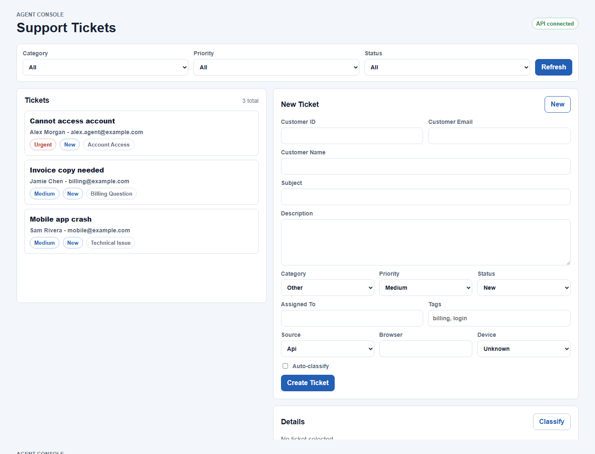
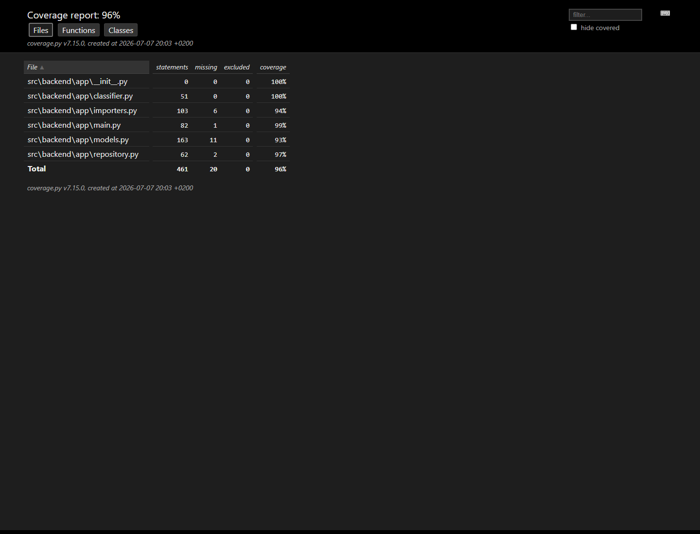

# Homework 2 - Intelligent Customer Support System

## Summary

Implemented a FastAPI ticket-management system with CRUD, CSV/JSON/XML bulk import, transparent automatic classification, combined filters, responsive frontend, multi-audience documentation, sample datasets, and comprehensive tests.

## AI-assisted workflow

Codex supported task decomposition, implementation, test generation, and documentation. Generated behavior was checked with integration and performance tests and reviewed against the required data model and import rules.

## Verification

```powershell
cd homework-2
python -m pip install -r requirements.txt
python -m pytest
```

Verified result: 70 tests passed with 96% coverage.

## Evidence




## Challenges

The main design challenge was providing consistent validation across three import formats while preserving per-record error details. Classification remains deterministic and explainable rather than hiding decisions behind an external model.

