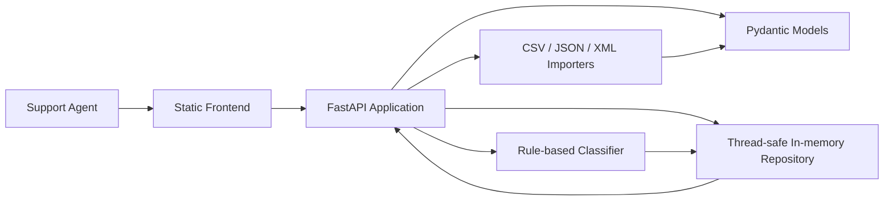

# Homework 2: Intelligent Customer Support System

> **Student Name**: [Your Name]  
> **Date Submitted**: [Date]  
> **AI Tools Used**: Codex for implementation and developer documentation; ChatGPT-style planning for task decomposition; rule-based local classifier for ticket categorization.

---

## Project Overview

This project implements a customer support ticket management system with:

- A FastAPI REST API for creating, importing, filtering, updating, deleting, and classifying tickets.
- CSV, JSON, and XML bulk ticket import with per-record validation errors.
- Automatic category and priority assignment using transparent keyword rules.
- A plain HTML/CSS/JavaScript frontend for support agents.
- A pytest suite with integration and performance tests.
- Multi-audience documentation for developers, API consumers, technical leads, and QA engineers.

## Features

- Ticket CRUD endpoints.
- Filtering by category, priority, and status.
- Bulk import from CSV, JSON, and XML.
- Auto-classification on demand, on ticket creation, and during import.
- Classification confidence, reasoning, keyword storage, manual override tracking, and decision logs.
- Responsive frontend with list, filters, forms, detail view, import upload, and classify action.
- Thread-safe in-memory repository for deterministic test behavior.

## Architecture



## Tech Stack

- Backend: Python, FastAPI, Pydantic, Uvicorn
- Frontend: Plain HTML, CSS, and JavaScript
- Testing: pytest, pytest-cov, FastAPI TestClient
- Storage: in-memory repository

## Project Structure

```text
homework-2/
|-- docs/
|   |-- screenshots/
|   |-- API_REFERENCE.md
|   |-- ARCHITECTURE.md
|   `-- TESTING_GUIDE.md
|-- sample_data/
|-- scripts/
|-- src/
|   |-- backend/
|   |   `-- app/
|   |-- frontend/
|   `-- .gitkeep
|-- tests/
|-- .env.example
|-- pytest.ini
|-- README.md
|-- requirements.txt
`-- TASKS.md
```

## Setup

Create and activate a virtual environment:

```powershell
python -m venv .venv
.\.venv\Scripts\Activate.ps1
```

Install dependencies:

```powershell
pip install -r requirements.txt
```

## Run Backend

```powershell
uvicorn src.backend.app.main:app --reload
```

The API will be available at:

```text
http://127.0.0.1:8000
```

On Windows, you can also run:

```powershell
.\scripts\run_backend.ps1
```

## Run Frontend

The frontend is a static app. From the `homework-2` folder, run:

```powershell
python -m http.server 5173 -d src/frontend
```

Then open:

```text
http://127.0.0.1:5173
```

On Windows, you can also run:

```powershell
.\scripts\run_frontend.ps1
```

## Run Tests

```powershell
pytest
```

Current verified result:

```text
70 passed
Coverage: 96%
```

## Additional Documentation

- [API Reference](docs/API_REFERENCE.md)
- [Architecture](docs/ARCHITECTURE.md)
- [Testing Guide](docs/TESTING_GUIDE.md)

<div align="center">

*This project was completed as part of the AI-Assisted Development course.*

</div>
