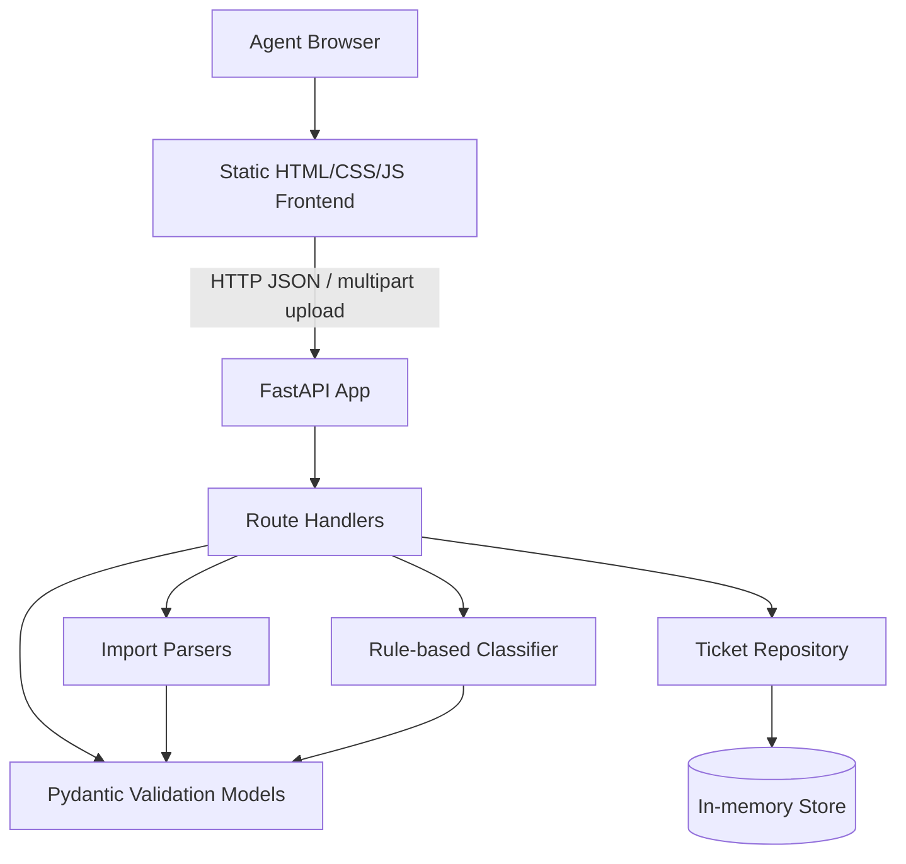
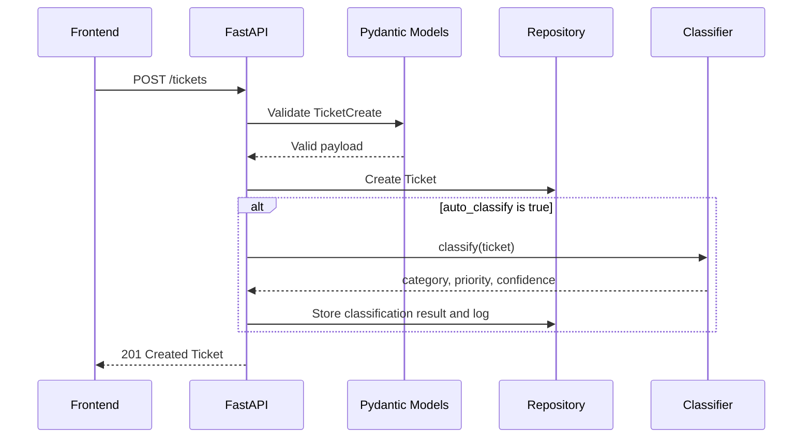
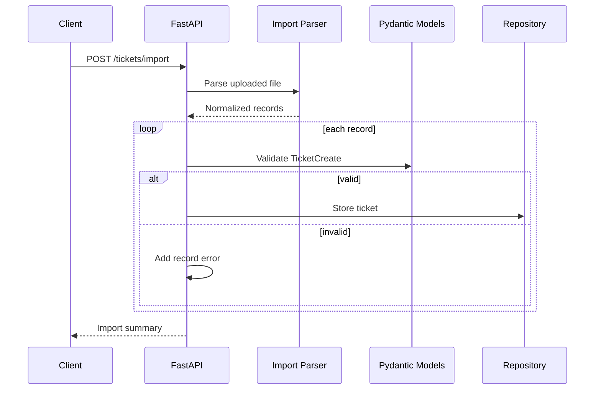

# Architecture

Audience: technical leads reviewing structure, boundaries, and trade-offs.

## System Overview

## Components

`src/backend/app/main.py`  
Defines the FastAPI application, CORS, ticket CRUD routes, import route, classification route, and classification log route.

`src/backend/app/models.py`  
Defines enums, ticket schemas, import summaries, classification schemas, timestamp behavior, update behavior, and validation.

`src/backend/app/repository.py`  
Provides a thread-safe in-memory repository using `RLock`. It stores tickets and classification logs.

`src/backend/app/importers.py`  
Parses CSV, JSON, and XML into normalized dictionaries that are validated by `TicketCreate`.

`src/backend/app/classifier.py`  
Implements transparent keyword-based category and priority classification.

`src/frontend/`  
Contains the static agent console. It calls the REST API directly and does not hardcode ticket data.

## Ticket Creation Flow

## Import Flow

## Data Flow

1. Input arrives from the frontend, curl, tests, or imported files.
2. FastAPI routes delegate validation to Pydantic schemas.
3. Valid tickets are stored in the repository.
4. Importers normalize format-specific input before validation.
5. The classifier reads subject, description, and tags.
6. Classification results are written back to the ticket and logged.
7. The frontend renders API responses and displays feedback.

## Design Decisions

- FastAPI was chosen for concise route definitions, automatic validation, and OpenAPI support.
- Pydantic centralizes validation so direct API creation and import creation use the same rules.
- The repository is in-memory to keep the homework focused on API behavior and tests. A production system would replace this with a database-backed repository.
- Classification is rule-based instead of ML-based so decisions are explainable, deterministic, and easy to test.
- The frontend uses plain HTML/CSS/JS to avoid framework setup overhead.
- The repository uses `RLock` so concurrent test requests do not race on dictionary mutation.

## Security Considerations

- Email, enum, length, and file-format validation are enforced server-side.
- CORS is restricted to local frontend origins.
- Uploaded files are parsed as text and are not written to disk.
- XML parsing uses the standard library and only reads ticket fields; production hardening would use a stricter XML parser and file size limits.
- There is no authentication in this homework implementation. Production use would require authenticated agents and authorization checks.

## Performance Considerations

- All current operations are in-memory and fast for homework-scale datasets.
- Import parsing is linear in record count.
- Filtering is linear over stored tickets.
- Classification is keyword matching over small text fields.
- Production use would require pagination, database indexes, rate limiting, and durable logging.
