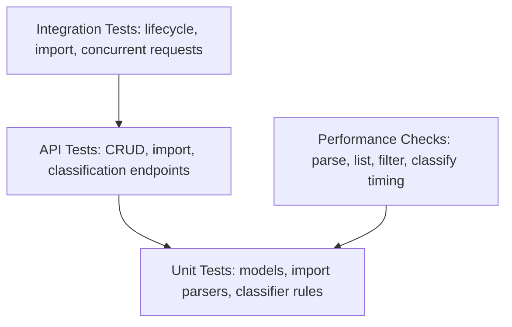

# Testing Guide

Audience: QA engineers and reviewers validating behavior and coverage.

## Current Result

Latest verified local run:

```text
70 passed
Coverage: 96%
```

## Test Pyramid



## How to Run Tests

Install dependencies:

```powershell
pip install -r requirements.txt
```

Run all tests:

```powershell
pytest
```

Run one file:

```powershell
pytest tests/test_ticket_api.py
```

Run with coverage output:

```powershell
pytest --cov=src/backend/app --cov-report=term-missing --cov-report=html
```

The HTML report is generated in:

```text
htmlcov/index.html
```

## Test Files

| File | Purpose |
|------|---------|
| `tests/test_ticket_model.py` | Pydantic model and validation behavior |
| `tests/test_ticket_api.py` | Ticket CRUD endpoints |
| `tests/test_ticket_import_api.py` | Import endpoint behavior |
| `tests/test_import_csv.py` | CSV parser behavior |
| `tests/test_import_json.py` | JSON parser behavior |
| `tests/test_import_xml.py` | XML parser behavior |
| `tests/test_categorization.py` | Category and priority classifier rules |
| `tests/test_classification_api.py` | Classification endpoint, logs, override behavior |
| `tests/test_integration.py` | End-to-end workflows and concurrency |
| `tests/test_performance.py` | Lightweight timing benchmarks |

## Sample Data

Manual sample data is stored in:

```text
sample_data/
|-- sample_tickets.csv
|-- sample_tickets.json
|-- sample_tickets.xml
|-- invalid_tickets.csv
|-- invalid_tickets.json
`-- invalid_tickets.xml
```

## Manual Testing Checklist

- Start backend with `.\scripts\run_backend.ps1`.
- Start frontend with `.\scripts\run_frontend.ps1`.
- Open `http://127.0.0.1:5173`.
- Confirm API status shows connected.
- Create a ticket with valid customer and description data.
- Try submitting an invalid email and confirm client/server validation.
- Filter tickets by category, priority, and status.
- Select a ticket and verify details show metadata and classification.
- Click Classify and confirm category, priority, confidence, reasoning, and keywords are shown.
- Edit category or priority and confirm manual override is reflected.
- Import CSV, JSON, and XML files from `sample_data/`.
- Import invalid sample files and confirm failed records are reported.
- Delete a ticket and confirm it disappears from the list.
- Resize the browser to mobile width and confirm controls remain usable.

## Performance Benchmarks

| Test | Expected |
|------|----------|
| Create 100 tickets | Under 2.5 seconds |
| List 500 tickets | Under 0.5 seconds |
| Filter 500 tickets | Under 0.5 seconds |
| Parse 250 CSV records | Under 0.25 seconds |
| Parse 250 JSON records | Under 0.25 seconds |
| Classify 500 tickets | Under 0.5 seconds |

These are lightweight homework benchmarks. Production performance tests should use a dedicated load tool and persistent storage.
