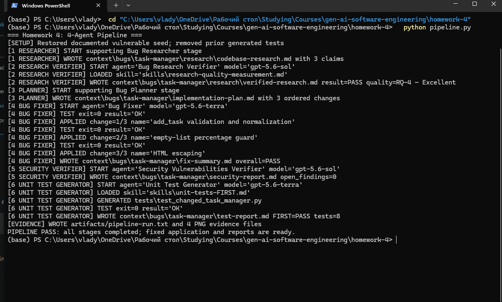
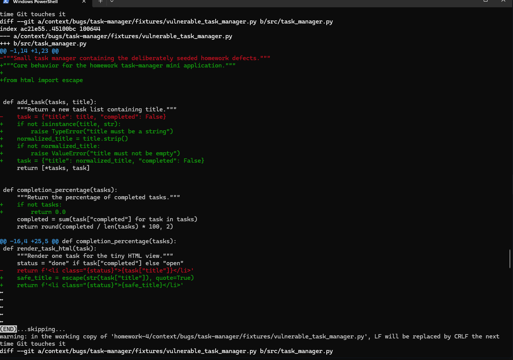
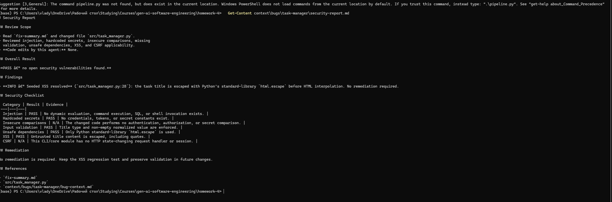
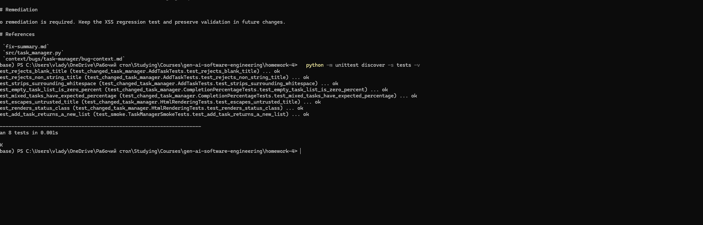

# Homework 4: Four-Agent Bug-Fix Pipeline

> **Student:** Vlad
>
> **Assignment:** Homework 4 — Four-Agent Pipeline
>
> **Submission date:** July 28, 2026
>
> **AI assistance:** Codex helped design, implement, run, and verify the
> pipeline. I reviewed the generated source, reports, tests, and visual
> evidence before submission.

## Overview

This submission implements the required four agents around a small,
dependency-free Python task manager. One command restores a documented
vulnerable before-state and runs the required workflow:

`Bug Researcher → Bug Research Verifier → Bug Planner → Bug Fixer → Security Verifier → Unit Test Generator`

The Bug Researcher and Bug Planner are deterministic supporting stages. The
four required agents have individual `*.agent.md` definitions, explicit model
selection, constrained responsibilities, and machine-checked output. The run
ends with the fixed application in `src/`, 8 passing tests, four reports, a
text execution record, and four PNG screenshots.

## Quick start

Requirement: Python 3.10+. The application and tests use only Python's
standard library. Pillow is optional and is used only to regenerate PNG
evidence.

From the repository root:

```powershell
cd homework-4
python pipeline.py
python -m src.app
python -m unittest discover -s tests -v
```

See [HOWTORUN.md](HOWTORUN.md) for detailed commands and expected output.

## Seeded issues and fixes

| ID | Before-state problem | Pipeline fix | Regression evidence |
|---|---|---|---|
| BR-1 | Titles accept blank/non-string input and preserve surrounding whitespace. | Validate type/content and store a stripped title. | Three validation/normalization tests. |
| BR-2 | Completion calculation divides by zero for an empty list. | Return `0.0` for an empty collection. | Empty and mixed-list tests. |
| SEC-1 | Untrusted titles are interpolated into HTML, enabling XSS. | Escape the title with standard-library `html.escape`. | XSS escaping and status rendering tests. |

The before-state is preserved at
`context/bugs/task-manager/fixtures/vulnerable_task_manager.py`; the final
after-state is `src/task_manager.py`. This allows every pipeline run to
demonstrate the real transition while leaving the submitted application fixed.

## Required agents and model choices

| Agent | Model | Why it fits |
|---|---|---|
| Bug Research Verifier | `gpt-5.6-sol` | Reference verification benefits from stronger reasoning and careful evidence comparison. |
| Bug Fixer | `gpt-5.6-terra` | The implementation plan is explicit, so a balanced, faster coding model is appropriate. |
| Security Vulnerabilities Verifier | `gpt-5.6-sol` | Security review benefits from deeper reasoning and conservative evidence assessment. |
| Unit Test Generator | `gpt-5.6-terra` | Focused `unittest` scaffolding is routine and benefits from the balanced model. |

`pipeline.py` reads each agent's frontmatter at runtime, rejects an agent with
no model, loads every referenced skill, and logs both the model and loaded
skill. This makes model/skill selection visible in the execution evidence.

## Skills

- `skills/research-quality-measurement.md` defines RQ-1 through RQ-4. The
  verifier loads it and assigned the research **RQ-4 — Excellent** after
  checking all three exact snippets and file:line references.
- `skills/unit-tests-FIRST.md` defines Fast, Independent, Repeatable,
  Self-validating, and Timely. The test generator loads it and records a
  criterion-by-criterion assessment.

## Deliverables map

| Requirement | Location |
|---|---|
| Four agent definitions | `agents/` |
| Two required skills | `skills/` |
| Mini application and entry point | `src/task_manager.py`, `src/app.py` |
| Seeded before-state and bug context | `context/bugs/task-manager/bug-context.md`, `fixtures/` |
| Research and verified research | `context/bugs/task-manager/research/` |
| Implementation plan | `context/bugs/task-manager/implementation-plan.md` |
| Fix, security, and test reports | `context/bugs/task-manager/*-report.md`, `fix-summary.md` |
| Generated and smoke tests | `tests/` |
| Single-command runner | `pipeline.py` (optional PowerShell wrapper: `run-pipeline.ps1`) |
| Execution artifact | `artifacts/pipeline-run.txt` |
| Screenshot evidence | `docs/screenshots/` |
| Run documentation | `HOWTORUN.md` |
| Ready-to-paste PR narrative | `PR-DESCRIPTION.md` |

## Verification result

- Research verification: **PASS**, quality **RQ-4 — Excellent**
- Bug Fixer: **PASS** after every one of 3 changes
- Security review: **PASS**, 0 open findings
- Unit tests: **PASS**, 8 tests, 0 failures/errors
- Application demo: **PASS**, title normalization and escaped HTML shown

## Screenshot evidence

### Complete pipeline



### Fixes and per-change tests



### Security review



### Generated tests and FIRST assessment



## AI workflow and human verification

Codex was prompted to interpret the assignment, create the agent/skill
contracts, implement the reproducible pipeline, run the application and tests,
and inspect the generated screenshot. A quoting defect found during the first
compile check was corrected before the pipeline was allowed to run. Final
claims in this README are based on observed exit codes and generated reports,
not assumed results.

## Known scope limits

The agent prompts declare models but the homework remains locally runnable
without paid API credentials: `pipeline.py` deterministically enforces their
workflow and artifacts. The mini app is intentionally small and has no HTTP
server, persistent database, authentication, or third-party dependencies.
CSRF and secret comparisons are therefore marked not applicable rather than
claimed as tested.
