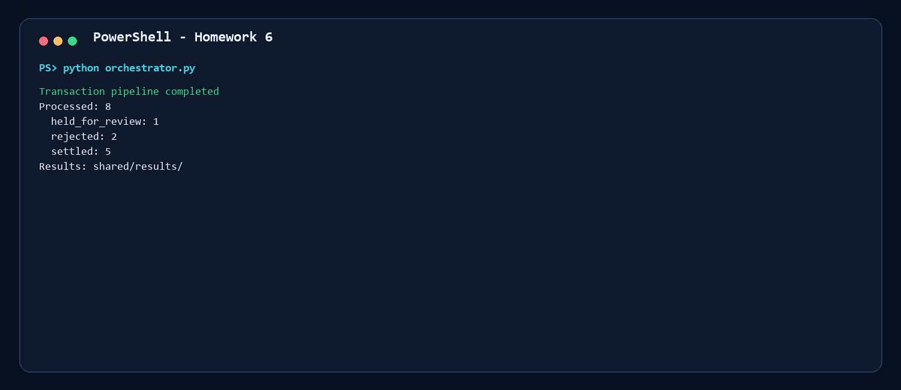
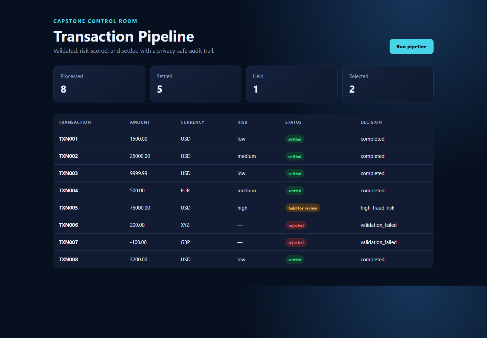
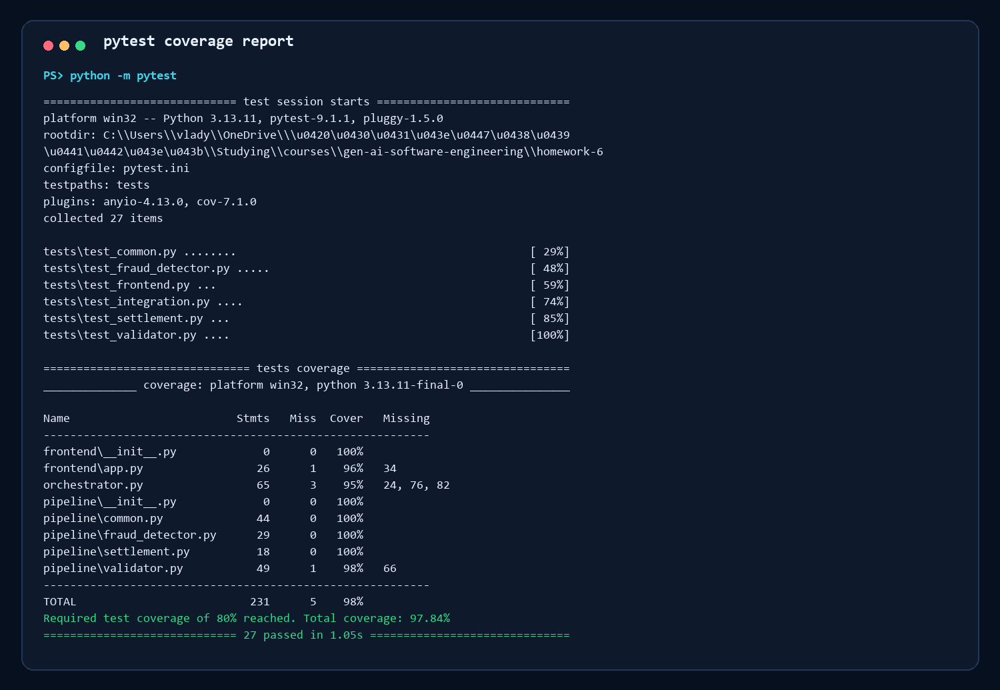
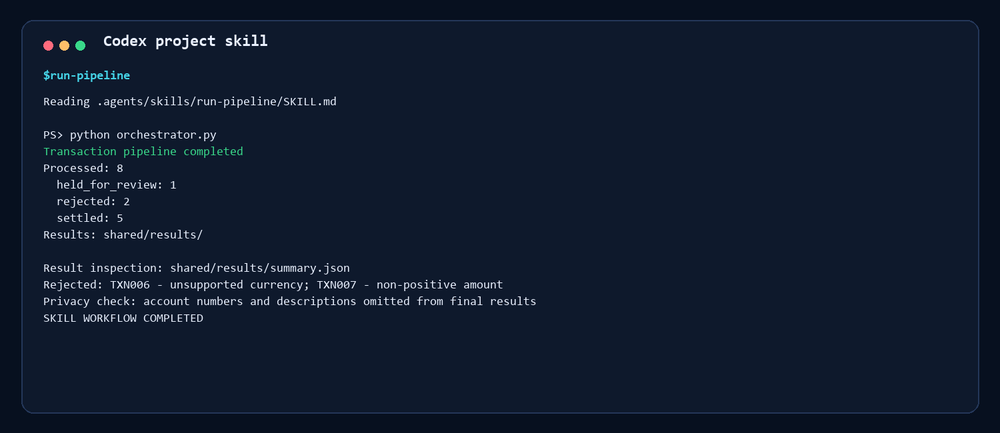
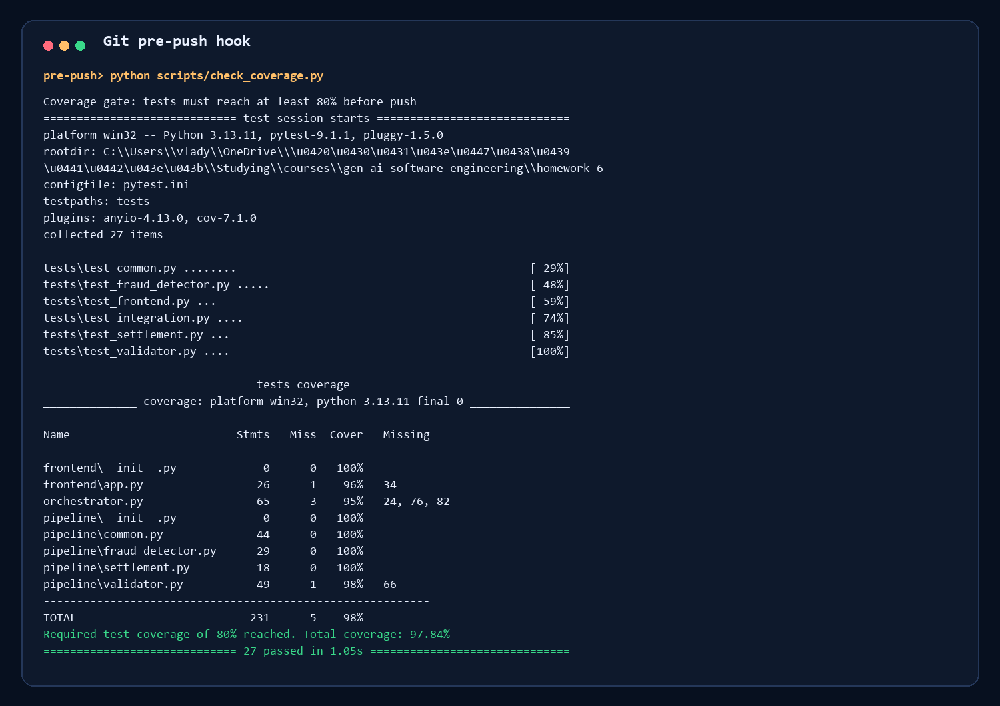
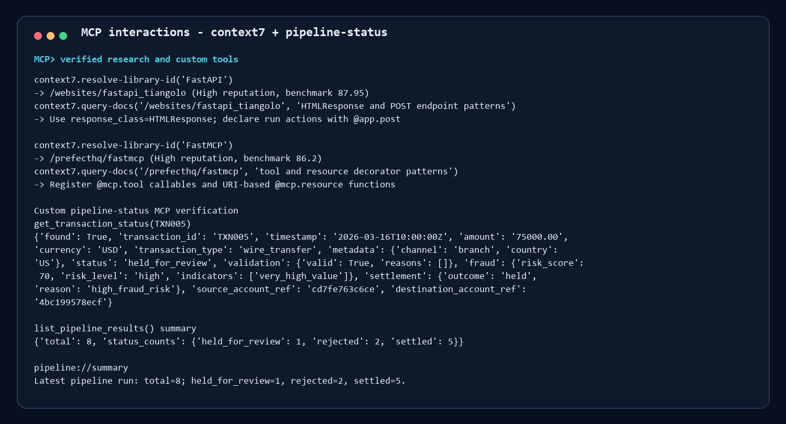

# Homework 6 - AI-Powered Transaction Processing Pipeline

## Summary

This PR completes the final capstone by implementing a specification-driven transaction pipeline with validation, fraud scoring, settlement, a FastAPI dashboard, and a queryable FastMCP server. All eight sample records produce privacy-safe final results: five settle, one is held for fraud review, and two are rejected during validation.

## Author

Vladyslav Shmygelskyy

## AI-assisted workflow

- Agent 1 produced `specification.md` from the project `$write-spec` skill.
- Agent 2 implemented each specified stage and used context7 for FastAPI and FastMCP patterns; exact queries and library IDs are in `research-notes.md`.
- Agent 3 created isolated stage and integration tests plus an 80% pre-push gate.
- Agent 4 prepared the README, runbook, evidence, and capstone presentation.
- I verified generated code by running the complete pipeline, dry-run validation, 27 tests, the MCP calls, and visual checks.

## Architecture and behavior

`sample-transactions.json` → validation → fraud detection → settlement → `shared/results/`. Standard JSON envelopes document stage transitions. Audit events contain only UTC timestamp, stage, transaction ID, and outcome. Final files replace accounts with derived references and omit descriptions.

## How to verify

```powershell
cd homework-6
python -m pip install -r requirements.txt
python orchestrator.py
python -m pytest
python scripts/verify_mcp.py
python -m uvicorn frontend.app:app --host 127.0.0.1 --port 8000
```

See [the complete runbook](HOWTORUN.md).

## Test results

- 27 tests passed
- 97.84% statement coverage
- Required 80% coverage gate enabled in `pytest.ini` and `.githooks/pre-push`
- Integration tests use temporary directories instead of the project `shared/` tree

## Evidence

### Pipeline run



### Web dashboard



### Test coverage



### Codex run-pipeline skill



### Coverage hook



### MCP interaction



## Presentation

[Open the capstone presentation PDF](docs/presentation.pdf)

## Challenges and decisions

- Invalid inputs still need observable final outcomes, so the orchestrator bypasses later decisions but writes a final rejection record.
- The assignment asks for a hook that blocks pushes; the committed Git pre-push hook performs the actual block, while Codex/Claude configurations document the AI workflow integration.
- Sensitive fields are necessary during processing but inappropriate in result evidence, so the final boundary removes descriptions and replaces accounts with derived references.

